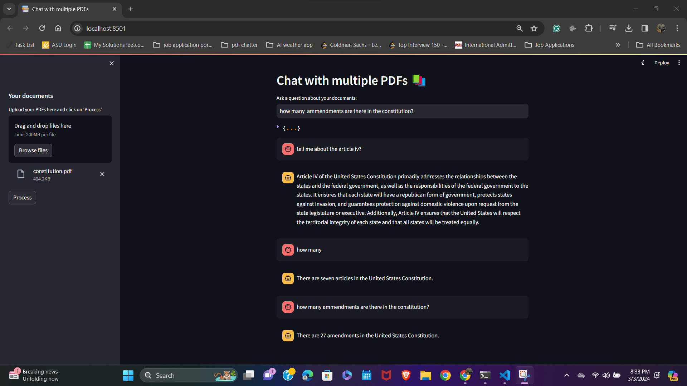
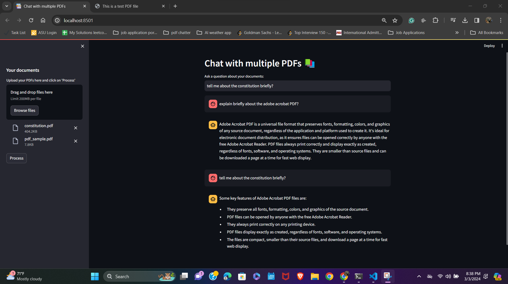

Aim: The main aim of this project is to create a Multiple PDF chatter application using the RAG (Retriever Argumented Generation) method using the Large Language models.

Tech stack:
    1. LangChain
    2. OpenAI Embeddings
    3. OpenAI Large Language Model
    4. Streamlit - for the UI

The main 
The below is the mentioned pdf chatbot 

In this project, we can upload multiple PDFs

The format of the chat history storage is shown here:

